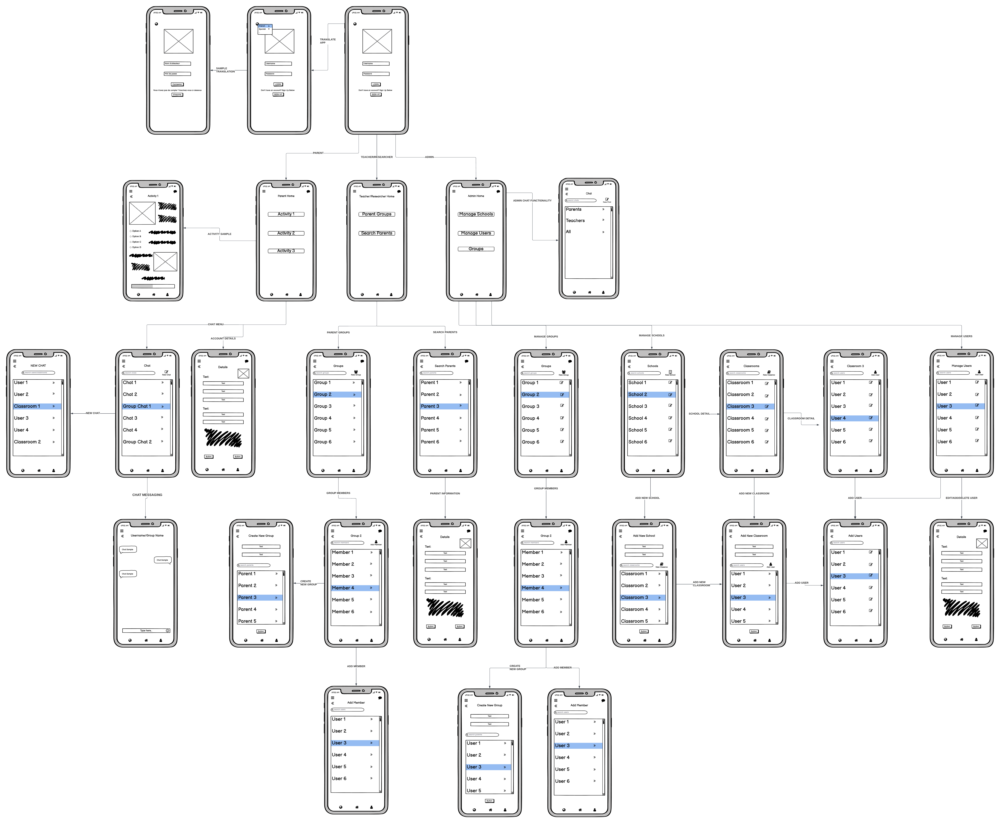
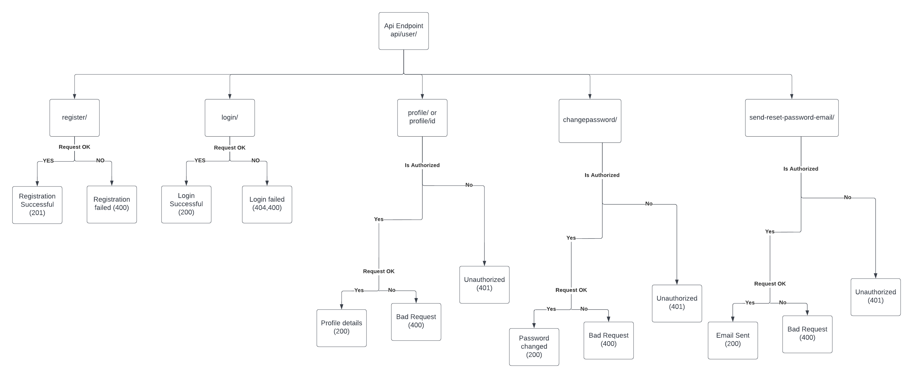

# Software Design

## High-level Architecture

---

## Major Data Elements

---

## Interaction Scenarios

---

## Low-fidelity User Interface

---

## Latest UML Diagram (Will be updated as we progress)

---

## Latest API Flowchart (Will be updated as we progress)

---

## Detailed Design

[https://www.figma.com/file/CXDeqntO7tIghC5yLOpbq7/Samuel-Rittwage-Scott's-team-library?node-id=0%3A1](https://www.figma.com/file/CXDeqntO7tIghC5yLOpbq7/Samuel-Rittwage-Scott's-team-library?node-id=0%3A1)