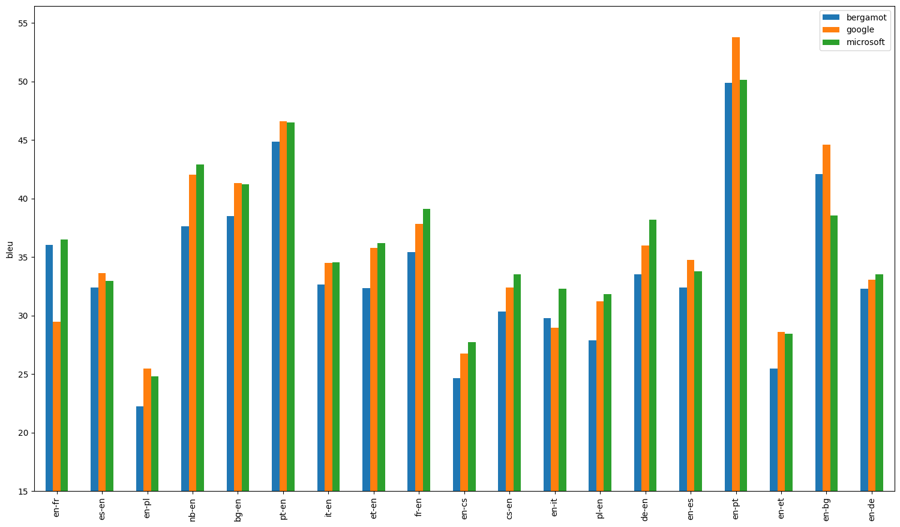
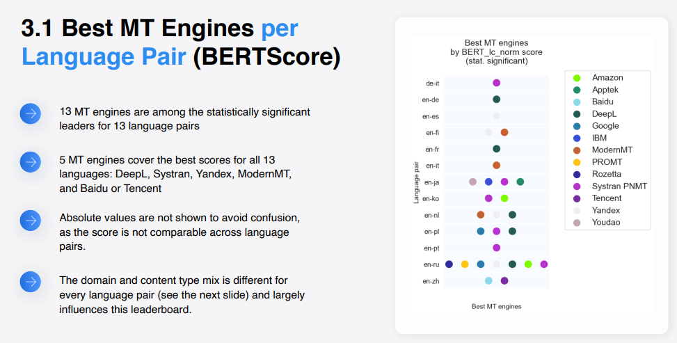
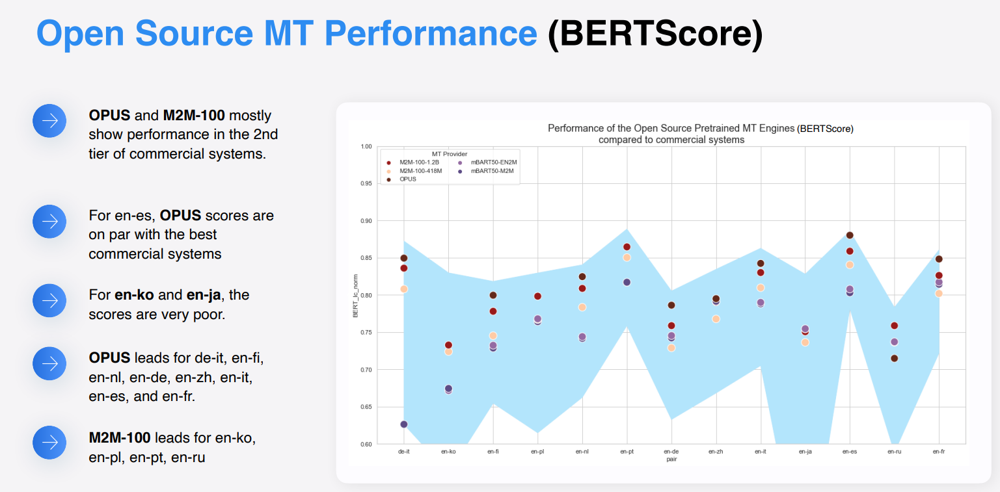
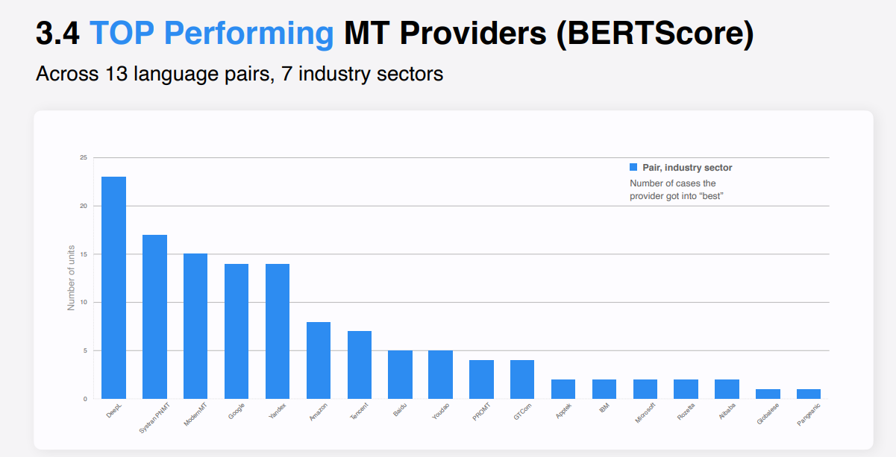

# Project Requriements 

## Executive Summary 

> For years, multilingual families have struggled to communicate with predominantly English and French-speaking teachers and researchers. This language barrier would often prevent teachers from consulting with parents about their children’s needs, and researchers from gaining a full understanding of bilingual development. LinGrow is the novel web app solution designed to bridge this gap between multilingual families and teachers/researchers. The heart of the LinGrow app is a messaging functionality between parents and teachers, with built-in translation supporting over 40 languages. This facilitates fast and easy communication between both parties, without the hassle of running everything through a separate service, or having the child relay and translate all information. To provide further support, LinGrow provides several built-in language development activities and simple English Guidelines to assist multilingual families. LinGrow aims to create a bridge of communication between parents, researchers and teachers, to overcome the language barrier and help children achieve their full potential.

---

## Project Glossary

* **Parent**: Parents are users who can:

> * Receive messages from teachers, researchers, or admins.
> * Be invited to join the messaging groups from teachers or researchers.

* **Researcher**: Researchers are users who can:

> * Message teacher(s) or parent(s).
> * Create groups of parents or teachers.

* **Teacher**: Teachers are users who can:

> * Message parent(s).
> * Create groups of parents from same classroom.

* **Admin**: Admins are users who can:

> * Message any parent(s), researcher(s), or teacher(s).
> * Create and manage schools.
> * Create and manage users.

* **Classroom**: Contains a single teacher and many parents.

* **School**: Collection of Classrooms.

---

## User Stories

### User Story 1 - Admin School Management [GitHub Link](https://github.com/UAlberta-CMPUT401/lingrow/issues/3)

> **As** an admin, **I want** to be able to manage schools, **so that** I can add/delete/update schools.
>
> **Acceptance Tests:**
>
> 1. Admin can add a school.
> 2. Admin can delete a school.
> 3. Admin can edit a school.
> 4. Non-Admin users cannot add/delete/edit schools.

### User Story 2 - Admin User Management [GitHub Link](https://github.com/UAlberta-CMPUT401/lingrow/issues/5)

> **As** an admin, **I want** to be able to manage users, **so that** I can add/delete/update users.
>
> **Acceptance Tests:**
>
> 1. Admin can add a user.
> 2. Admin can delete a user.
> 3. Admin can edit a user.
> 4. Non-Admin users cannot add/delete/edit users.

### User Story 3 - Admin Messaging [GitHub Link](https://github.com/UAlberta-CMPUT401/lingrow/issues/8)

> **As** an admin, **I want** to be able to send mass messages to any group of users, **so that** I can inform them about updates to the app.
>
> **Acceptance Tests:**
>
> 1. Admin can compose a message, and send a message.
> 2. Admin can select a group to receive the message.
> 3. Message sent by Admin is marked as an Admin Message.
> 4. Non-Admins cannot send messages marked as Admin messages.

### User Story 4 - Admin Group Users [GitHub Link](https://github.com/UAlberta-CMPUT401/lingrow/issues/8)

> **As** an Admin, **I want** to be able to group users, **so that** I can send messages to select groups.
>
> **Acceptance Tests:**
>
> 1. Admin can search for specific users.
> 2. Admin can select multiple users to create a group from.
> 3. Admin can reference that group they created again later.
> 4. Admin can edit a group they created.
> 5. Admin can delete a group they created.
> 6. Non-admin users cannot create groups in the same way.

### User Story 5 - User Account Creation [GitHub Link](https://github.com/UAlberta-CMPUT401/lingrow/issues/15)

> **As** a User, **I want** to be able to create an account, **so that** I can log into the web application and use its features.
>
> **Acceptance Tests:**
>
> 1. User can create an account. 
> 2. User can sign in with their created credentials.
> 3. User cannot create an account with the already used credentials.

### User Story 6 - User Logout [GitHub Link](https://github.com/UAlberta-CMPUT401/lingrow/issues/18)

> **As** a User, **I want** to be able to logout of the web application, **so that** I can keep my information private and secure.
>
> **Acceptance Tests:**
>
> 1. User can log out of the application.
> 2. User when logged out cannot access their user info.

### User Story 7 - User Password Reset [GitHub Link](https://github.com/UAlberta-CMPUT401/lingrow/issues/17)

> **As** a User, **I want** to be able reset my password, **so that** I am still able to access my account if I forgot my password.
>
> **Acceptance Tests:**
>
> 1. User can prompt for a password reset without their password.
> 2. User upon receiving a password reset prompt, can change it.
> 3. User must use new password to sign in aftewards.

### User Story 8 - Non-Admin Message Sending [GitHub Link](https://github.com/UAlberta-CMPUT401/lingrow/issues/12)

> **As** a Parent/Teacher/Researcher **I want** to be able to send messages, **so that** I can communicate with others within the application.
>
> **Acceptance Tests:**
>
> 1. User can compose a message to another selected user.
> 2. User can send a composed message.

### User Story 9 - Non-Admin Message Reception [GitHub Link](https://github.com/UAlberta-CMPUT401/lingrow/issues/14)

> **As** a Parent/Teacher/Researcher **I want** to be able to receive messages, **so that** I can communicate with others within the application.
>
> **Acceptance Tests:**
>
> 1. User can receive messages. 
> 2. User can view messages received.
> 3. User can compose a message to the sender of a received message.

### User Story 10 - Teacher/Researcher Search Parents [GitHub Link](https://github.com/UAlberta-CMPUT401/lingrow/issues/7)

> **As** a Teacher/Researcher **I want** to be able to search for parents within a school, **so that** I can identify parents I associate with.
>
> **Acceptance Tests:**
>
> 1. Teacher/Researcher can view parents in their selected school. 
> 2. Teacher/Researcher can search their selected school for specific parents.

### User Story 11 - Teacher/Researcher Group Parents [GitHub Link](https://github.com/UAlberta-CMPUT401/lingrow/issues/21)

> **As** a Teacher/Researcher **I want** to be able to create a group of parents based on their children's classroom, **so that** so that I can organize parents based on their children's classroom.
>
> **Acceptance Tests:**
>
> 1. Teacher/Researcher can select multiple parents to create a group from.
> 2. Teacher/Researcher can reference that group they created again later.
> 3. Teacher/Researcher can edit a group they created.
> 4. Teacher/Researcher can delete a group they created.

### User Story 12 - Teacher/Researcher Important Flag [GitHub Link](https://github.com/UAlberta-CMPUT401/lingrow/issues/20)

> **As** a Teacher/Researcher **I want** to be able to mark messages as important, **so that** parents understand when information I am communicating is critical.
>
> **Acceptance Tests:**
>
> 1. Teacher/Researcher can mark a message as important before sending it. 
> 2. Receiver of that message can see it marked as important.

### User Story 13 - Teacher/Researcher Mass Messaging [GitHub Link](https://github.com/UAlberta-CMPUT401/lingrow/issues/22)

> **As** a Teacher/Researcher **I want** to be able to send mass messages to groups of parents, **so that** I can convey messagaes related toa group at once.
>
> **Acceptance Tests:**
>
> 1. Teacher/Researcher can send a message to multiple users at a time. 
> 2. Receivers all receive the same message sent by the teacher/researcher.

### User Story 14 - Researcher Search Teachers [GitHub Link](https://github.com/UAlberta-CMPUT401/lingrow/issues/10)

> **As** a Researcher **I want** to be able to search for teachers within a school, **so that** I can identify teachers I associate with.
>
> **Acceptance Tests:**
>
> 1. Researcher can view teachers in their selected school. 
> 2. Researcher can search their selected school for specific teachers.

### User Story 15 - Researcher Group Teachers [GitHub Link](https://github.com/UAlberta-CMPUT401/lingrow/issues/47)

> **As** a Researcher **I want** to be able to create a group of teachers, **so that** so that I can organize multiple teachers I am working with.
>
> **Acceptance Tests:**
>
> 1. Researcher can select multiple teachers to create a group from.
> 2. Researcher can reference that group they created again later.
> 3. Researcher can edit a group they created.
> 4. Researcher can delete a group they created.

### User Story 16 - Parent App Translation [GitHub Link](https://github.com/UAlberta-CMPUT401/lingrow/issues/4)

> **As** a Parent **I want** to be able to translate text within the app to a more familiar language, **so that** I am able to read and understand the information the application is communicating to me.
>
> **Acceptance Tests:**
>
> 1. Parent can without needing to read text select another lanaguage to translate the application to. 
> 2. All intentionally readable text is translated to a specific language when selected.

### User Story 17 - User Message Translation [GitHub Link](https://github.com/UAlberta-CMPUT401/lingrow/issues/2)

> **As** a User **I want** to be able to translate received messages to a language I am more familiar with, **so that** I am able to read and understand the received message better.
>
> **Acceptance Tests:**
>
> 1. User can when viewing a message select another language for it to be translated into. 
> 2. Message is translated when another language is selected.

### User Story 18 - Parent Pictograms [GitHub Link](https://github.com/UAlberta-CMPUT401/lingrow/issues/13)

> **As** a Parent **I want** to be able to see pictograms to help me identify important information, **so that** I can more easily understand the associated concepts.
>
> **Acceptance Tests:**
>
> 1. Pictograms are visible in the application to parents. 
> 2. Pictograms are placed with their relevant activities/information.

### User Story 19 - Parent Speech to Text [GitHub Link](https://github.com/UAlberta-CMPUT401/lingrow/issues/6)

> **As** a Parent **I want** to be able to use Speech-to-Text, **so that** I can compose a message without the need for understanding written english grammar.
>
> **Acceptance Tests:**
>
> 1. Parents can select the Speech-to-Text when composing a message. 
> 2. Typing is disabled while Speech-to-Text is active.
> 3. Speech is properly interpreted by the program.

### User Story 20 - Parent Text to Speech [GitHub Link](https://github.com/UAlberta-CMPUT401/lingrow/issues/9)

> **As** a Parent **I want** to be able to use Text-to-Speech, **so that** I can understand written information as though it was spoken.
>
> **Acceptance Tests:**
>
> 1. Text-to-Speech is an option for all text within the application.
> 2. Parents are able to activate the Text-to-Speech for whichever text they would like to listen to.

### User Story 21 - Parent Voicemail Messaging [GitHub Link](https://github.com/UAlberta-CMPUT401/lingrow/issues/19)

> **As** a Parent **I want** to be able to send and receive voicemail through messages, **so that** I can communicate with audio instead of text.
>
> **Acceptance Tests:**
>
> 1. Parents able to send voice recordings through messages.
> 2. Parents are able to receive voice recordings through messages.

### User Story 22 - Parent Video Call Messaging [GitHub Link](https://github.com/UAlberta-CMPUT401/lingrow/issues/16)

> **As** a Parent **I want** to be able to send and receive video messages, **so that** I can communicate with non-verbal/textual cues alongside verbal.
>
> **Acceptance Tests:**
>
> 1. Parents able to send videos through messages.
> 2. Parents are able to receive videos through messages.

### User Story 23 - Parent English Learning Activities [GitHub Link](https://github.com/UAlberta-CMPUT401/lingrow/issues/11)

> **As** a Parent **I want** to be able to view and English Learning Activities, **so that** I can support language development within my family.
>
> **Acceptance Tests:**
>
> 1. English Learning Activities are provided within the application for parents.
> 2. These English Learning Activities are available in multiple languages.

### User Story 24 - Parent Simple English [GitHub Link](https://github.com/UAlberta-CMPUT401/lingrow/issues/48)

> **As** a Parent **I want** the application to be written in simple english phrases, **so that** when I translate the application there are as few translation errors as possible.
>
> **Acceptance Tests:**
>
> 1. The application is written in simple english phrases.
> 2. The application does not use complex phrases or words.
> 3. The application does not use english sayings or idioms.

### User Story 25 - Invite Users [GitHub Link](https://github.com/UAlberta-CMPUT401/lingrow/issues/49)
> **As** a Teacher **I want** to send invite links to group of parents, **so that** parents can easily sign up for the app.
>
> **Acceptance Tests:**
>

---

## MoSCoW

### Must Have

* School management for admins
    - (User Story 1) **As** an admin, **I want** to be able to manage schools, **so that** I can add/delete/update schools.
* Text Messaging
    - (User Story 8) **As** a Parent/Teacher/Researcher **I want** to be able to send messages, **so that** I can communicate with others within the application.
    - (User Story 9) **As** a Parent/Teacher/Researcher **I want** to be able to receive messages, **so that** I can communicate with others within the application.
* Account (researcher/teacher/parent/admin)
    - (User Story 5) **As** a User, **I want** to be able to create an account, **so that** I can log into the web application and use its features.
    - (User Story 6) **As** a User, **I want** to be able to logout of the web application, **so that** I can keep my information private and secure.
* Parent search/grouping for researcher/teacher
    - (User Story 10) **As** a Teacher/Researcher **I want** to be able to search for parents within a school, **so that** I can identify parents I associate with.
    - (User Story 11) **As** a Teacher/Researcher **I want** to be able to create a group of parents based on their children's classroom, **so that** so that I can organize parents based on their children's classroom.
* App-wide translation
    - (User Story 16) **As** a Parent **I want** to be able to translate text within the app to a more familiar language, **so that** I am able to read and understand the information the application is communicating to me. 
    - (User Story 17) **As** a User **I want** to be able to translate received messages to a language I am more familiar with, **so that** I am able to read and understand the received message better.
* Language-development activities
    - (User Story 23) **As** a Parent **I want** to be able to view and English Learning Activities, **so that** I can support language development within my family.

### Should Have

* User management for admins
    - (User Story 2) **As** an admin, **I want** to be able to manage users, **so that** I can add/delete/update users.
    - (User Story 4) **As** an Admin, **I want** to be able to group users, **so that** I can send messages to select groups.
* Group messaging functionality
    - (User Story 3) **As** an aAdmin, **I want** to be able to send mass messages to any group of users, **so that** I can inform them about updates to the app.
    - (User Story 13) **As** a Teacher/Researcher **I want** to be able to send mass messages to groups of parents, **so that** I can convey messagaes related toa group at once.
* Simple English guidelines
    - (User Story 14) **As** a Parent **I want** the application to be written in simple english phrases, **so that** when I translate the applcation there are as few translation errors as possible.
* Pictogram
    - (User Story 18) **As** a Parent **I want** to be able to see pictograms to help me identify important information, **so that** I can more easily understand the associated concepts.
* User Password Reset
    - (User Story 7) **As** a User, **I want** to be able reset my password, **so that** I am still able to access my account if I forgot my password.
* Simple English 
    - (User Story 24) **As** a Parent **I want** the application to be written in simple english phrases, **so that** when I translate the applcation there are as few translation errors as possible.

### Could Have

* Reseracher parent grouping
    - (User Story 15) **As** a Researcher **I want** to be able to create a group of teachers, **so that** so that I can organize multiple teachers I am working with.
* Invite links for parent group
    - (User Story 25) **As** a Teacher **I want** to send invite links to group of parents, **so that** parents can easily sign up for the app.
* Mark messages as important
    - (User Story 12) **As** a Teacher/Researcher **I want** to be able to mark messages as important, **so that** parents understand when information I am communicating is critical.
* Text-to-speech
    - (User Story 20) **As** a Parent **I want** to be able to use Text-to-Speech, **so that** I can understand written information as though it was spoken.

### Would Like But Won't Get

* Speech-to-text
    - (User Story 19) **As** a Parent **I want** to be able to use Speech-to-Text, **so that** I can compose a message without the need for understanding written english grammar.
* Voice messaging
    - (User Story 21) **As** a Parent **I want** to be able to send and receive voicemail through messages, **so that** I can communicate with audio instead of text.
* Video messaging
    - (User Story 22) **As** a Parent **I want** to be able to send and receive video messages, **so that** I can communicate with non-verbal/textual cues alongside verbal.

---

## Similar Products

> What follows is a list of available Machine Translation services. Each service features a Pricing and Languages section explaining their rates and supported languages, which is backed up with a current source from their website. After the services comparison, there is a “translation quality” section, giving context to each service’s accuracy.
>
> Note that all prices are in USD unless specified otherwise. 

### DEEPL

> **Pricing ([https://www.deepl.com/pro?cta=header-prices](https://www.deepl.com/pro?cta=header-prices)):** 
>
> - 0.5 million characters a month are FREE
> - 1m characters for $30.03 CAD
>
> **Languages ([https://www.deepl.com/docs-api/translate-text/response](https://www.deepl.com/docs-api/translate-text/response)):**
>
> - Has 29 languages 

### Google Cloud

> **Pricing ([https://cloud.google.com/translate/pricing](https://cloud.google.com/translate/pricing)):**
> 
> - 0.5m a month are FREE
> - 1m for $20, until 1 billion characters 
> 
> **Languages ([https://cloud.google.com/translate/docs/languages](https://cloud.google.com/translate/docs/languages)):**
> 
> - ~125 languages

### AWS

> **Pricing:**
> 
> - Standard translation is 2m a month are FREE FOR 12 MONTHS
> - Standard translation is $15 per 1m
> - Active custom translation “uses parallel data to customize the machine translated output”.
> - Active custom translation is 0.5m characters a month FREE FOR 2 MONTHS
> - Active custom translation is $60 per 1m
>
> **Languages ([https://aws.amazon.com/translate/faqs/](https://aws.amazon.com/translate/faqs/)):**
> 
> - 75 languages 

### AZURE

> **Pricing ([https://azure.microsoft.com/en-us/pricing/details/cognitive-services/translator/#pricing](https://azure.microsoft.com/en-us/pricing/details/cognitive-services/translator/#pricing)):**
> 
> - 2m a month are FREE FOR 12 MONTHS
> - Standard translation is $10 for 1m
> - Document translation is $15 for 1m
> - Custom translation
> - Text/document translation is $40 USD per 1m
> - Other options are also available, however they don’t seem relevant for us
>
> **Languages ([https://learn.microsoft.com/en-us/azure/cognitive-services/translator/language-support](https://learn.microsoft.com/en-us/azure/cognitive-services/translator/language-support)):** 
>
> - 100+ languages 

### SYSTRAN 

> **Pricing ([https://www.systran.net/en/plans-pricing/](https://www.systran.net/en/plans-pricing/)):**
> 
> - There’s a lot of different payment options, and there’s a 2 week free trial, but the cheapest is $5.49 a month for 150 pages of text (if 1 page is 1800 chars, this is 270 000 chars)
> - https://www.lexika-translations.com/blog/what-is-a-standard-page/
>
> **Languages ([https://www.systran.net/en/plans-pricing/](https://www.systran.net/en/plans-pricing/)):**
> 
> - 50 languages

### Yandex 

> **Pricing:**
> 
>> **Yandex translate ([https://translate.yandex.com/developers/offer/prices](https://translate.yandex.com/developers/offer/prices)):**
>>
>> - $15 for 1m, under 50m max
>>
>> **Yandex cloud translate ([https://cloud.yandex.com/en/docs/translate/pricing](https://cloud.yandex.com/en/docs/translate/pricing)):**
>>
>> - ~$4 for 1m
>
> **Languages ([https://yandex.com/support/translate-mobile/supported-langs.html](https://yandex.com/support/translate-mobile/supported-langs.html)):**
>
> - 102 languages

### ModernMT 

> **Pricing ([https://www.modernmt.com/pricing/#enterprises](https://www.modernmt.com/pricing/#enterprises)):**
>
> - Free FOR 1 MONTH
> - $8 per 1m, may have an hour turnaround time
>
> **Languages ([https://www.modernmt.com/translators/](https://www.modernmt.com/translators/)):**
>
> - 64 languages

### Supplemental Data

#### Bergamot Google Microsoft BLEU score comparison:

- Bergamot’s quality is slightly worse than Google and Microsoft, who got similar BLEU scores

#### Amazon Microsoft Google human and metric comparison:

- https://anno-ai.medium.com/evaluating-machine-translation-providers-68b8430debc3
- *“We were surprised to discover that the three providers showed comparable performance, and none really emerged as a clear winner. Although AWS slightly edged out the others in three out of four languages as scored by the metrics means, GCP received the highest human ratings in three out of four languages. Azure scored lower in metrics means (except in Chinese) and human ratings, but showed the lowest standard deviation across languages, indicating more consistency in translation quality.”*

#### 2021 State of Machine Translation Report:

#### Quick comparison of open source MT services:

- Generally slightly worse than the commercial systems 
- *“Open-source engines perform in the 2nd tier of commercial systems, except for en-es (on par with top-tier systems) and en-ko & en-ja (much worse than commercial systems).“*

---

## Open-source Projects

### LibreTranslate

- Open source translation API
- Uses open source translation engine to power the translation (Argos Translate.)
- Easy to use, but requires the purchase of API key that is a monthly payment of ~$18/month.  
- Cost may be expensive since it is a monthly payment, rather than a translation count like most services. 

### Moses

- Open source translation system that utilizes statistical methods 
- Strays very close to ML since it requires the training of the model. 
- Complex model but should provide a better and more accurate translation than the API.
- method not recommended since it is a complex system and may be hard to expand later (adding more languages)

### Apertium
 
- Is a free/open-source platform for developing rule-based machine translation systems!
- Will most likely give the best translation since the developers set the rule for how each language syntax should be formed. 
- The most work to use in terms of setting everything up. If we need at least 40 languages, that's at the very least 40 rules we have to write up. 

---

## Technical Resources

### Backend - Django REST, PostgreSQL

- Django REST Framework
    - Documentation
        - [Official Documentation](https://www.django-rest-framework.org/tutorial/quickstart/)
        - [Permissions](https://www.django-rest-framework.org/api-guide/permissions/)
        - [Django User Model and Authentication](https://docs.djangoproject.com/en/4.1/ref/contrib/auth/)
    - Tutorials
        - [YouTube Tutorial](https://www.youtube.com/watch?v=c708Nf0cHrs)
        - [CMPUT 401 Tutorial](https://github.com/UAlberta-CMPUT401/tutorial-django-todo-backend)
        - [Multiple User Types](https://simpleisbetterthancomplex.com/tutorial/2018/01/18/how-to-implement-multiple-user-types-with-django.html)
    - Troubleshoot
        - [Stack Exchange](https://stackexchange.com/search?q=django+rest+framework)

- PostgreSQL
    - Documentation
        - [Official Documentation](https://www.postgresql.org/files/documentation/pdf/13/postgresql-13-A4.pdf)
        - [PostgreSQL Django Integration](https://docs.djangoproject.com/en/4.1/ref/databases#postgresql-notes)
    - Troubleshoot
        - [Stack Exchange (Djongo)](https://stackoverflow.com/search?q=django+postgresql&searchOn=3)

### Frontend - React

- React
    - Documentation
        - [Official Documentation](https://reactjs.org/docs/getting-started.html)
    - Tutorials
        - [Digital Ocean (Django & React)](https://www.digitalocean.com/community/tutorials/build-a-to-do-application-using-django-and-react)
        - [YouTube Playlist (Django & React)](https://www.youtube.com/playlist?list=PLzMcBGfZo4-kCLWnGmK0jUBmGLaJxvi4j)
        - [Basic Hello World App (Django & React)](https://www.youtube.com/watch?v=F9o4GSkSo40)
        - [CMPUT 401 Tutorial](https://github.com/UAlberta-CMPUT401/tutorial-react-todo-frontend)
        -[Dev.to React User authentication](https://dev.to/koladev/django-rest-authentication-cmh)
        -[Video: Django Token Authentication](https://www.youtube.com/watch?v=0d7cIfiydAc&ab_channel=TraversyMedia)
    - Troubleshoot
        - [Stack Exchange](https://stackoverflow.com/search?q=react+django&searchOn=3)

### Deployment - Cybera

- Documentation
    - [Cybera Documentation](https://wiki.cybera.ca/#all-updates)
    - [Apache2 Django](https://docs.djangoproject.com/en/4.1/howto/deployment/wsgi/modwsgi/)
- Tutorial
    - [Deploy Django Linux Server Apache2](https://www.youtube.com/watch?v=Sa_kQheCnds)
    - [Cybera CMPUT 401 Tutorial](https://docs.google.com/presentation/d/13Yr9jvl5jKX5PNauNx9JuMUOOhiuaQ2BtB3ig4UXcWw/edit?usp=sharing)
    - [Cyber Screencast](https://www.youtube.com/watch?v=jv4D8I_AwTQ)
- Troubleshoot
    - [Stack Exchange](https://stackoverflow.com/search?q=django+linux+server&searchOn=3)