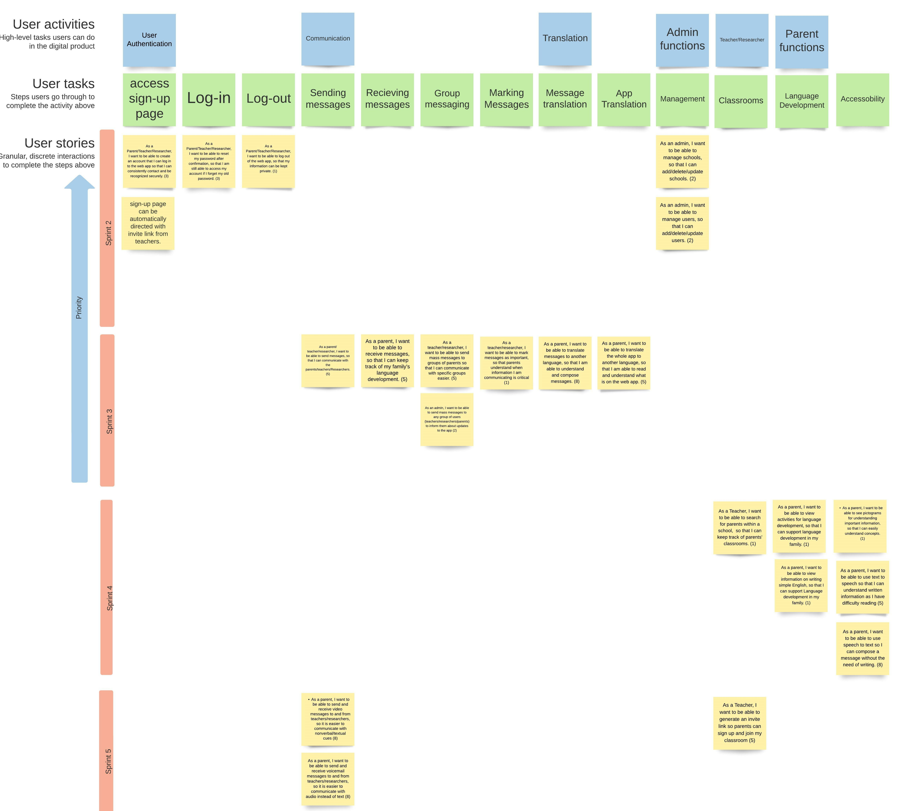

# Project Management

## Story Map

---

## Project Plan

### Sprint 1

* **Due**: September 24, 2022

| Tasks                   | Related US    | Assigned To                                 | Due Date |
|-------------------------|---------------|---------------------------------------------|----------|
| Executive Summary       | Documentation | Jeff                                        | Sept. 23 |
| User Stories            | Documentation | Loyal, Kash, Sam, Steve, Jeff, Kevin, Scott | Sept. 19 |
| Story Map               | Documentation | Steve                                       | Sept. 23 |
| High-level Architecture | Documentation | Loyal, Kash                                 | Sept. 21 |
| Major Data Elements     | Documentation | Sam, Scott                                  | Sept. 21 |
| Interaction Scenarios   | Documentation | Kevin, Jeff                                 | Sept. 21 |
| Low-fidelity UI         | Documentation | Loyal, Kash                                 | Sept. 21 |
| Team Canvas             | Documentation | Loyal, Kash, Sam, Steve, Jeff, Kevin, Scott | Sept. 21 |
| Belbin Role Matrix      | Documentation | Loyal, Kash, Sam, Steve, Jeff, Kevin, Scott | Sept. 19 |

### Sprint 2

* **Due**: October 15, 2022
* **Velocity Conversion**: tiny = 1, small = 2, medium = 3, large = 5, X-Large = 8

| Tasks                     | Related US(Story Points)   | Assigned To                    | Due Date|
|---------------------------|-----------------|---------------------------------------------|---------|
|Fix Sprint 1 documentation | Documentation(1)  | Loyal, Kash, Sam, Steve, Jeff, Kevin Scott| Oct. 7  |
| Backend for Users   | User Authentication (3) | Loyal, Kash                         | Oct. 11 |
| Backend for School and admin| Admin function (3)| Kevin, Jeff                            | Oct. 11 |
| Frontend Registration    | User creation (3)| Scott, Sam, Steve                          | Oct.14   |
| Frontend Login            |User Login and validation(3) | Sam, Scott, Steve              | Oct.14  |
| Frontend Logout           | User logout (1) | Sam, Scott, Steve                          | Oct. 14|
| Integration               | Usability (5)   | Loyal, Kash, Sam, Scott, Steve, Jeff, Kevin|Oct. 15|
| Detailed Design           | Documentation (1)| Sam, Kevin                                   | Oct. 15|
| Testing Frontend Login     | User Login(3) | Scott, Steve                                | Oct. 15|
| Testing Frontend Registration| User Creation(3)| Scott, Steve                            | Oct. 15|
| Testing Frontend Logout    | User Logout (3)  | Scott                                    | Oct. 15|
| Test case Backend User     | User authentication (3)| Loyal, Kash                        | Oct. 15|
| Test case Backend School/Admin| Admin function (2) | Kevin, Jeff                         |Oct. 15 |   
 

### Sprint 3

* **Due**: October 29, 2022
* **Velocity Conversion**: tiny = 1, small = 2, medium = 3, large = 5, X-Large = 8
* **SUBJECT TO CHANGE**

| Tasks                     | Related US(Story Points)   | Assigned To                    | Due Date|
|---------------------------|-----------------|---------------------------------------------|---------|
| Sending Messages          | Parent-Teacher communication(5)  |  Not yet decided        | Oct. 28  |
| Reciving Messages from Parent| Parent-Teacher Communication (5) | Not yet decided        | Oct. 28 |
| Sending Mass Messages    | Teacher group Message(5)|     Not yet decided                 | Oct. 28 |
| Send Mass messages       | Admin group message (2)| Not yet decided                          | Oct.28   |
| Mark Important Messages  |important messages(1) | Not yet decided                      | Oct.28 |
| Translate messages          | message translation(8) |  Not yet decided                  | Oct. 28|
| Translate Whole App       | App translation (5)   |  Not yet decided                      |Oct. 28|

### Sprint 4

* **Due**: November 19, 2022
* **Velocity Conversion**: tiny = 1, small = 2, medium = 3, large = 5, X-Large = 8
* **SUBJECT TO CHANGE**

| Tasks                     | Related US(Story Points)   | Assigned To                    | Due Date|
|---------------------------|-----------------|---------------------------------------------|---------|
| Search for Parents          | Teacher Function(1)  |  Not yet decided                    | Nov. 18  |
| Parent Activities        | Language Development (1)      | Not yet decided                    | Nov. 18 |
| Parent English information  | Language Development(1)|     Not yet decided                 | Nov. 18 |
| Pictograms               | Accessibility (1)| Not yet decided                      | Nov. 18   |
| Text-To-Speech            |Text-To-Speech (5) | Not yet decided                         | Nov. 18|
| Speech-to-Text         | Speech-to-Text (8) |  Not yet decided                  | Nov. 18|

### Sprint 5

* **Due**: December 3, 2022
* **Velocity Conversion**: tiny = 1, small = 2, medium = 3, large = 5, X-Large = 8
* **SUBJECT TO CHANGE**

| Tasks                     | Related US(Story Points)   | Assigned To                    | Due Date|
|---------------------------|-----------------|---------------------------------------------|---------|
| Clean-up                   | All (8)         |  Not yet decided                          | Dec. 2  |
| Implement other accessories| All (8)         | Not yet decided                           | Dec. 2  |
<!-- | Sending Mass Messages    | Teacher group Message(5)|     Not yet decided                 | Dec. 2  |
| Send Mass messages       | Admin group message (2)| Not yet decided                      | Dec. 2   |
| Mark Important Messages  |important messages(1) | Not yet decided                         | Dec. 2 |
| Translate messages          | message translation(8) |  Not yet decided                  | Dec. 2 |
| Translate Whole App       | App translation (5)   |  Not yet decided                      |Dec. 2 | -->