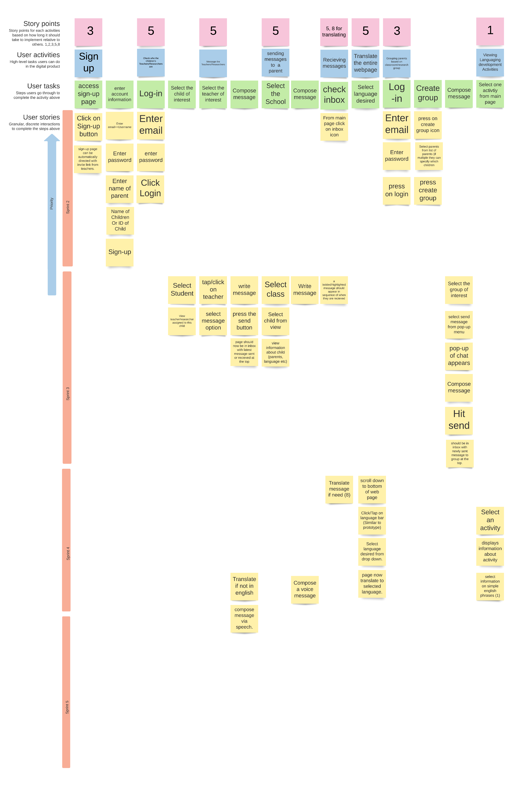

# Project Management

## Story Map

---

## Project Plan

### Sprint 1

* **Due**: September 24, 2022

| Tasks                   | Related US    | Assigned To                                 | Due Date |
|-------------------------|---------------|---------------------------------------------|----------|
| Executive Summary       | Documentation | Jeff                                        | Sept. 23 |
| User Stories            | Documentation | Loyal, Kash, Sam, Steve, Jeff, Kevin, Scott | Sept. 19 |
| Story Map               | Documentation | Steve                                       | Sept. 23 |
| High-level Architecture | Documentation | Loyal, Kash                                 | Sept. 21 |
| Major Data Elements     | Documentation | Sam, Scott                                  | Sept. 21 |
| Interaction Scenarios   | Documentation | Kevin, Jeff                                 | Sept. 21 |
| Low-fidelity UI         | Documentation | Loyal, Kash                                 | Sept. 21 |
| Team Canvas             | Documentation | Loyal, Kash, Sam, Steve, Jeff, Kevin, Scott | Sept. 21 |
| Belbin Role Matrix      | Documentation | Loyal, Kash, Sam, Steve, Jeff, Kevin, Scott | Sept. 19 |