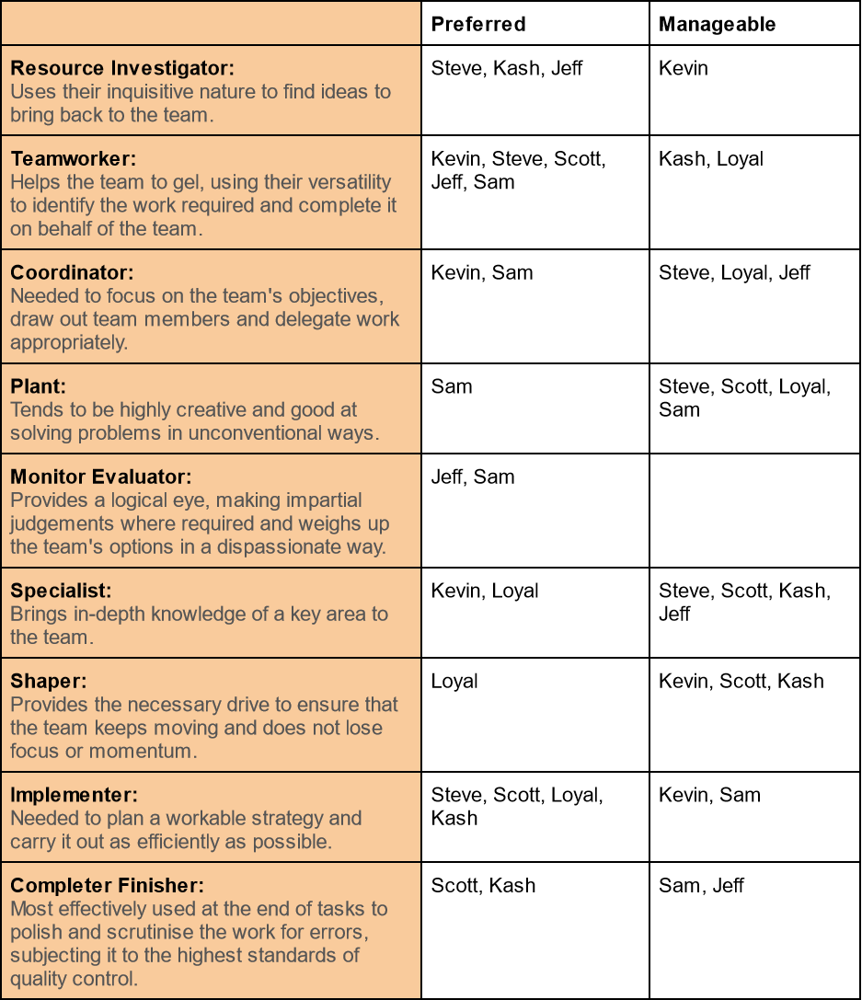

# Teamwork

## Team Canvas

---

## Belbin Roles

| Name  | Preferred   | Manageable  | Least Preferred |
|-------|-------------|-------------|-----------------|
| Kevin | CO, TW, SP  | SH, IMP, RI | PL, ME, CF      |
| Steve | TW, IMP, RI | CO, PL,SP   | CF, ME, SH      |
| Scott | TW, CF, IMP | SH, PL, SP  | CO, ME, RI      |
| Loyal | IMP, SH, SP | CO, PL, TW  | ME, RI, CF      |
| Kash  | IMP, CF, RI | SH, TW, SP  | PL, CO, ME      |
| Sam   | CO, ME, TW  | PL, IMP, CF | SH, RI, SP      |
| Jeff  | RI, TW, ME  | SP, CO, CF  | PL, SH, IMP     |

- **Source**: [https://www.belbin.com/about/belbin-team-roles](https://www.belbin.com/about/belbin-team-roles)

---

## Meeting Minutes

### September 15, 2022

> * 12:34pm - 1:12 pm
> * Google Meet

#### Agenda

> * Clarify requirements of the linGrow project.
> * Discuss options for implementing said requirements.

#### Atendee

> * Dr. Andrea McLeod (Client)
> * Dr. Catrine Demers (Client)
> * Kevin
> * Steve
> * Loyal
> * Sam
> * Scott
> * Kash

#### Minutes

> ##### Resources

>> * Links for prototype made available to linGrow team.
>> * Dyslexia-friendly font example provided to linGrow team.
>> * Activities to be used for linGrow app provided by client.
>> * Clients wants us to find the suitable option for translation tool.

> ##### Requirements

>> * For video messaging, try to compromise between app performance and video quality.
>> * Pictograms mark important messages, since messanger (teachers, researchers) can't always rely on text-based communication.
>> * Text-to-speech is "next step" functionality.
>> * Researchers and teachers have messaging access to parents in their class.
>> * Parent can only receive messages.
>> * Admin can manage schools.
>> * Teachers can create groups of parents based on the classroom they belong to.
>> * Web app must be compatible with multiple languages, regardless of their writing directions.

> ##### Miscellaneous

>> * linGrow should be free to Parents, but fee could be charged to organizations?
>> * Parent grouping could be done through invite email or SMS.

#### Action Items

> ##### All Teams

>> * Scan options for translation tools suitable for linGrow.
>> * Will need to analyze costs for each option.
>> * Need to form user stories.

---

### September 16, 2022

> * 3:30 PM - 4:50 PM
> * Google Meet

#### Agenda

> * Discuss strategies for making Sprint 1 deliverable.
> * Form user stories.

#### Atendee

> * Kevin
> * Jeff
> * Kash
> * Loyal
> * Steve
> * Sam
> * Scott

#### Minutes

> ##### User Stories

>> * Formed 21 user stories total.

> ##### Sprint 1

>> * Discussed dividing workload for Sprint 1 contents.

#### Action Items

> ##### All Teams

>> * Individual works over weekend for Sprint 1 items, if desired.

---

### September 19, 2022

> * 9:00 AM - 11:00 AM
> * CSC B-10

#### Agenda

> * Preparation for Sprint 1.

#### Atendee

> * Kevin
> * Steve
> * Scott
> * Loyal
> * Kash

#### Minutes

> ##### Sprint 1

>> * Detailed discussion regarding expected contents for Sprint 1 documentation.
>> * Formed Belbin team role matrix.
>> * Created template for Team Canvas.

#### Action Items

> ##### All Teams

>> * Need to assign story points, and confirm MoSCoW placement of each user stories.
>> * Need to complete Belbin role matrix and Team Canvas.

> ##### Loyal, Kash

>> * Assigned to work on low-fidelity wireframe UI.

> ##### Steve

>> * Assigned to work on story map.

---

### September 20, 2022

> * 5:00 PM - 7:20 PM
> * Google Meet

#### Agenda

> * Delegate tasks for Sprint 1 deliverable.
> * Complete teamwork activities.

#### Attendee

> * Kevin
> * Jeff
> * Kash
> * Loyal
> * Steve
> * Sam
> * Scott

#### Minutes

> ##### User Stories

>> * Assigned story points to each user story.
>> * Assigned MoSCoW category to each user story.

> ##### Teamwork

>> * Completed Belbin matrix and Team Canvas.

> ##### Software Design

>> * Delegated tasks for completing software design diagrams.
>> * Completed wireframe from Loyal and Kash presented to the team.

#### Action Items

> ##### Scott, Sam
 
>> * Assigned to work on major data elements diagram.

> ##### Jeff, Kevin

>> * Assigned to work on interaction sequence diagram.

> ##### Loyal, Kash

>> * Assigned to work on high-level architecture.

> ##### Steve

>> * Continue working on story map.

---

### September 21, 2022

> * 4:30 - 4:42
> * Google Meet

> * 4:

#### Agenda

> * Review work-in-progress deliverables for Sprint 1 with TA.
> * Confirm remaining tasks with TA.
> * Complete miscellaneous tasks for Sprint 1.
> * Schedule second client meeting.

#### Attendee

> * Mohayemin (TA)
> * Loyal
> * Kash
> * Steve
> * Kevin
> * Scott
> * Sam

#### Minutes

> ##### Sprint 1 Review

>> * Reviewed current progress of the team with TA.

> ##### Software Design

>> * High-level architecture diagram completed.

> ##### Project Requirements

>> * Assigned workload for similar products and open source products.

#### Action Items

> ##### Steve

>> * Assigned to work on open source products for project requirements.

> ##### Kevin

>> * Assigned to work on similar products for project requirements.

> ##### Scott

>> * Assigned to create and deploy Github documentation page.

> ##### Jeff

>> * Assigned to work on executive summary.

> ##### Sam

>> * Assigned to email clients for possible date for second client meeting.

---

### September 23, 2022

> * 5:00 - 6:07 PM
> * Google Meet

#### Agenda

> * Clarify confusions and discrepancies regarding UI.
> * Update Sprint 1 deliverable to the clients' updated specification.

#### Attendee

> * Jeff
> * Steve
> * Sam
> * Scott
> * Kash
> * Kevin

#### Minutes

> ##### Requirements

>> * Researchers should be able to message teachers.
>> * Admin can group all users, and send group messages.

> ##### User Stories

>> * Updated user stories based as per clients' requirements.
>> * Updated MoSCoW and story points accordingly.

> ##### Software Design

>> * Interaction sequence updated.
>> * Major data elements updated.

> ##### Miscellaneous

>> * Story map fianlized.
>> * Discussed Mkdocs and producing Github documentation pages.

#### Action Items

> ##### Sam

>> * Updating user stories and creating acceptance tests.
>> * Update major data element diagram based on clients' updated requirements.

> ##### Jeff, Kevin

>> * Update interaction sequence diagram based on clients' updated requirements.

> ##### Kash, Loyal

>> * Adapt low-fidelity user interface for the Github documentation page.

> ##### Steve

>> * Complete story maps for Github documentation page.

> ##### Scott

>> * Assigned to search technical resources relevant for linGrow architecture.